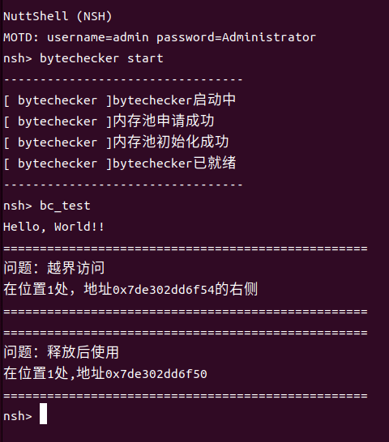

# ByteChecker

#### 队伍介绍

<hr>

| 赛题   | [proj248-heap_detection](https://github.com/oscomp/proj248-heap_detection) |
|:---- | -------------------------------------------------------------------------- |
| 学校   | 西华大学                                                                       |
| 队伍名称 | ostar                                                                      |
| 小组成员 | 赵扬、游帅、郭桂阳                                                                  |
| 项目导师 | 钟建                                                                         |

#### 项目简介

<hr>

Nuttx是一个在嵌入式设备中广泛使用的RTOS，经过多年的发展，Nuttx功能丰富，性能稳定，商业化成熟度高。而在开发应用程序的同时，往往不可避免的出现内存泄漏等异常状况，本项目学习了Nuttx中现有的内存检测工具，设计并实现了Nuttx版本的类似kfence的工具byteChecker。

bytechecker是一种基于nuttx的低开销采样的堆内存检测器，可用于检测use-after-free，invalid-free和out-of-bounds等错误。byteChecker作为应用程序使用，可以在测试时随意开启或关闭，具有较高的灵活性。对内存的检测主要发生在malloc和free阶段，通过hook原本的malloc和free函数实现内存检测操作，通常不会对当前进程造成影响。

#### 实现思路

<hr>

我们参考linux中kfence的实现方法，制作了基于nuttx操作系统的”阉割版kfence“。

1. 申请一块用于检测的内存池大小为：( 数据页数量 * 2 + 1 ) * 数据页大小，将其初始化

2. 重写malloc和free函数，并接管源文件中包含bytechecker头文件中的malloc和free函数

3. 当申请内存时，若本次申请合法，将返回bc内存池中的一块空闲内存，并根据其申请的大小在该内存前后填充特定的字节

4. 当释放内存时，会检测填充的字节是否被篡改已检测程序是否出现内存异常的情况

```shell
  ---+-----------+-----------+-----------+---
     | xxxxxxxx | O | xxxxxx | xxxxxxxx |
     | xxxxxxxx | B | xxxxxx | xxxxxxxx |
     | x byte x | J | x by x | x byte x |
     | xxxxxxxx | E | x te x | xxxxxxxx |
     | xxxxxxxx | C | xxxxxx | xxxxxxxx |
     | xxxxxxxx | T | xxxxxx | xxxxxxxx |
  ---+-----------+-----------+-----------+---
```

#### 项目进程

<hr>

1. 成功将软件部署在nuttx上，通过输入命令进行执行

2. 完成了程序的初始化  

3. 静态检测部分已完成对use-after-free，invalid-free 和 out-of-bounds错误的检测，能够打印出现的问题及其发生问题的地址

4. 正在实现调用栈的获取以及程序计时器部分

5. 正在设计动态检测部分，能实现根据特征自动检测可能发生的内存错误

#### 项目文件说明

```shell
├── bc_main.c          # 程序核心代码
├── bytechecker.h      # bc头文件
├── CMakeLists.txt     # 编译相关
├── Kconfig            # 配置文件
├── Make.defs          # 编译相关
├── Makefile           # Makefile构建脚本
├── img                # 图片
|   ├── bc_test.png    # 测试截图
├── README.md          # README
```

#### 使用说明

<hr>

###### Nuttx编译

1. 从nuttx仓库克隆源代码及apps：
   
   ```shell
   git clone https://github.com/apache/nuttx.git
   git clone https://github.com/apache/nuttx-apps.git
   ```

2. 从仓库克隆本项目：
   
   ```shell
   git clone https://gitlab.eduxiji.net/ostart/project2210132-237230.git
   ```

3. 将本项目文件夹复制到apps文件夹里，在apps文件夹的Kconfig文件中添加以下文字：
   
   ```shell
   source "/home/(路径)/bytechecker/Kconfig"
   ```

4. 打开控制台，切换到nuttx/tools目录下，输入：
   
   ```shell
   sh configure.sh xxx:nsh
   ```
   
   **注意**：“xxx”处为开发板型号，如果没有可使用sim模拟器替代

5. 返回nuttx，输入：
   
   ```shell
   make menuconfig
   ```
   
   进入配置菜单，在 Application configuration 中找到 ByteChecker 并选中
   
   **参数**：
   
   - The number of metadata - 数据页数量
   
   - The size of memory - 数据大小
   
   - The time of gate - 检测间隔
   
   输入以下命令进行编译：
   
   ```shell
   make
   ```

6. 编译完成后输入以下命令启动nuttx：
   
   ```shell
   ./nuttx
   ```

###### ByteChecker使用

1. 在需要检测的项目源代码中包含“bytechecker.h”头文件
   
   ```c
   #include <xxx/bytechecker/bytechecker.h>
   ```

2. 编译完成后在nsh中启动bytechecker
   
   **参数**：
   
   - start - 启动bytechecker程序
   
   - stop - 停止bytechecker程序

3. 运行需要调试的程序，若存在内存异常bytechecker将会捕捉到并在程序运行结束后打印到nsh中

#### 测试

<hr>

简单测试的运行结果如图：


